Title: Funny Images
Author: spotless
Date: 2020-03-01 14:07
Slug: aero-ctf-2020-funny-images-captcha
Category: CTF
Summary: CTF challenge "Funny Images"

# Funny Images

> We found a site on which the flag is posted but it is hidden behind a
large number of captchas. As they understood, the owner does not like
bots and created his own captcha generator. Although I’m not a robot,
I can’t get beyond 200. Go through the entire captcha and get a reward flag.

- [http://tasks.aeroctf.com:40000/](http://tasks.aeroctf.com:40000/)

## Recon

The challenge shows a website on which we need to login.

<div class="float:left;">
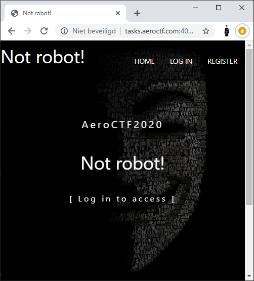

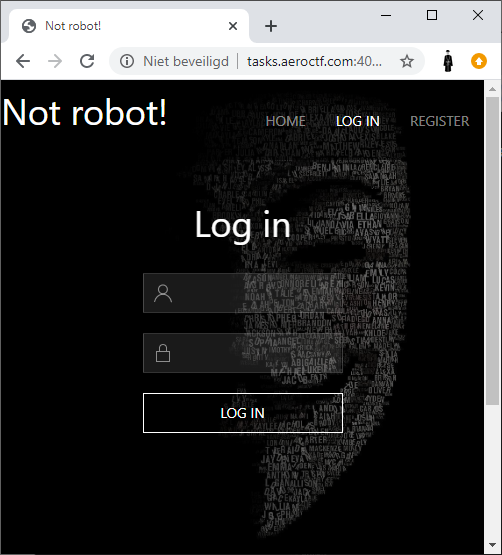

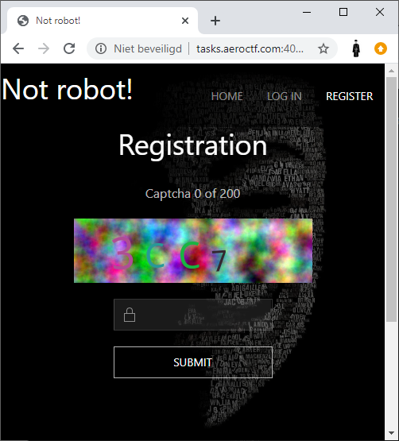
</div>

In order to login we need to register an account, however, the registration
option is protected by a captcha which we need to solve 200 times. To analyze
the captcha's we downloaded a bunch of them:

`perl -e 'for(1..100){qx[curl -s \"http://tasks.aeroctf.com:40000/gen.php\" -o $_.png]}'`

### Example captcha with value `FB82`:

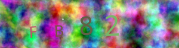

# Suspicious backgrounds

While looking at the various captcha's we figured out that the captcha's used a limited amount of different backgrounds. Which can be seen in these two different captcha's with the same background:


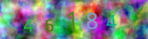

To find out how many backgrounds there were we created the following script which uses Perl and GD to read the images. The script calculates an MD5 over the first column of pixels. It then writes the files to an output file with the MD5 value in it.
```perl
use GD;
use Digest::MD5 qw(md5_hex);
# Install GD:
# apt-get install libgd-gd2-perl
# perl -MCPAN -e 'install GD'

GD::Image->trueColor(1);

for ($pngcount=1;$pngcount<=100;$pngcount++) {
  $checkline = "";
  $image = newFromPng GD::Image($pngcount.'.png');
  for ($pixelcount=0;$pixelcount<=81;$pixelcount++) {
    $checkline .= $image->getPixel(0, $pixelcount);
  }
  $md5 = md5_hex($checkline);
  print $md5."\n";
  $orgfilename = $pngcount.".png";
  $newfilename = $md5."_".$pngcount.".png";
  `cp $orgfilename $newfilename`;
}
```
The 100 sample captcha's we downloaded only contained 4 different backgrounds.

Since we now have sorted the captcha's per background, we can diff the files for each captcha to see what the background is. We do this by checking the most common pixel over all the files with the same background. That way we can export the background itself. This is the script used for 1 background (MD5 of the first column of pixels: `d4199c1b481c7363207d44de49445780`):

```perl
use GD;

GD::Image->trueColor(1);
$outfile = new GD::Image(300,81);

# Get dirlist
$dirlist = `ls -1a d4199c1b481c7363207d44de49445780*`;
@dirlist = split(/\n/,$dirlist);
# Read each file in dirlist
foreach $file (@dirlist) {
  $image = newFromPng GD::Image($file);
  $filecount++;
  print "Parsing ".$file."\n";
  # Read all pixels for each file
  for ($pixelcount2=0;$pixelcount2<=299;$pixelcount2++) {
    for ($pixelcount=0;$pixelcount<=81;$pixelcount++) {
      $pixelarray[$filecount][$pixelcount2][$pixelcount] .= $image->getPixel($pixelcount2, $pixelcount);
    }
  }
}

# Get amount of files
$fileamount = @dirlist;

# For each pixel, check which pixel is most common
for ($pixelcount2=0;$pixelcount2<=299;$pixelcount2++) {
  for ($pixelcount=0;$pixelcount<=81;$pixelcount++) {
    for ($count2=1;$count2<=$fileamount;$count2++) {
      push(@whichpixel,$pixelarray[$count2][$pixelcount2][$pixelcount]);
    }
    my %count;
    $count{$_}++ for @whichpixel;
    my ($winner, $winner_count) = each %count;
    while (my ($maybe, $maybe_count) = each %count) {
      if ($maybe_count > $winner_count) {
        $winner = $maybe;
        $winner_count = $maybe_count;
      }
    }
    undef @whichpixel;
    $outfile->setPixel($pixelcount2,$pixelcount,$winner)
  }
}

$png_data = $outfile->png;
open (OUTFILE,">background_d4199c1b481c7363207d44de49445780.png") || die;
binmode OUTFILE;
print OUTFILE $png_data;
close OUTFILE;
```

After running the script for the 4 different backgrounds we end up with the full background for each variation:

```
ls -la background_*
-rw-r--r-- 1 root root 45000 Feb 29 17:05 background_012cf208486fe088dc9f3c7ca4cd8b7e.png
-rw-r--r-- 1 root root 43238 Feb 29 17:04 background_72615be02a38943d656fb9edb5e2a155.png
-rw-r--r-- 1 root root 41506 Feb 29 17:03 background_cc451aa3a156b8c856fdd4d9dd2cb9f6.png
-rw-r--r-- 1 root root 41296 Feb 29 16:59 background_d4199c1b481c7363207d44de49445780.png
```

The background files:

### `background_012cf208486fe088dc9f3c7ca4cd8b7e.png`

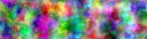

### `background_72615be02a38943d656fb9edb5e2a155.png`


### `background_cc451aa3a156b8c856fdd4d9dd2cb9f6.png`

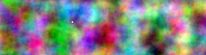

### `background_d4199c1b481c7363207d44de49445780.png`

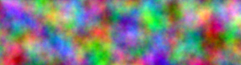

Since we now have the full background for each captcha, we can take that
background away when we receive a captcha. Script to request a new captcha & take
away the background and make the image black and white:

```perl
use GD;
use Digest::MD5 qw(md5_hex);
GD::Image->trueColor(1);

$outfile = new GD::Image(300,81);

print "Retrieving captcha\n";
`curl -s http://tasks.aeroctf.com:40000/gen.php -o captcha.png`;

# Getting captcha MD5 over first column of pixels
$image = newFromPng GD::Image('captcha.png');
for ($pixelcount=0;$pixelcount<=81;$pixelcount++) {
  $checkline .= $image->getPixel(0, $pixelcount);
}
$md5 = md5_hex($checkline);

# Open background file with the MD5 we got
$bgimage = newFromPng GD::Image('background_'.$md5.'.png');
$white = $image->colorAllocate(255,255,255);
# Diff all the pixels of the captcha and the background
for ($pixelcount2=0;$pixelcount2<=299;$pixelcount2++) {
  for ($pixelcount=0;$pixelcount<=81;$pixelcount++) {
    if ($image->getPixel($pixelcount2, $pixelcount) == $bgimage->getPixel($pixelcount2, $pixelcount)) {
      $outfile->setPixel($pixelcount2,$pixelcount,"000000")
    } else {
      $outfile->setPixel($pixelcount2,$pixelcount,$white)
    }

  }
}

$png_data = $outfile->png;
open (OUTFILE,">testfile.png") || die;
binmode OUTFILE;
print OUTFILE $png_data;
close OUTFILE;
```

Sample output from this script:


Sample output from this script (BW applied):


We tried reading these new captcha files with [tesseract](https://github.com/tesseract-ocr/tesseract) and [gocr](http://www-e.uni-magdeburg.de/jschulen/ocr/).
While they can read quite an amount of captcha's correctly, they fail pretty hard to get 200 captcha's in a row correct.

## Training GOCR

Out of the above 2 mentioned OCR tools; `gocr` works best "out of the box". We tried improving `gocr` to create/train our own database, like this:

```text
# gocr -m 2 -p gocrdb/ -C 0123456789ABCDEF -m 256 -m 130 testfile.png

# show box + environment
# show box     x=  174   18 d=  22  39 r= 0 0
# show pattern x=  154   16 d=  62  43 t= 1 2
,,,,,,,,,,,,,,,,,,,,,,,,,,,,,,,,,,,,,,,,,,,,,,,,,,,,,,,,,,,,,,
,,,,,,,,,,,,,,,,,,,,#####################.,,,,,,,,,,,,,,,,,,,, -
,,,,,,,,,,,,,,,,,,,,#####################.,,,,,,,,,,,,,,,,,,,,
,,,,,,,,,,,,,,,,,,,,#####################.,,,,,,,,,,,,,,,,,,,,
,,,,,,,,,,,,,,,,,,,,.#####................,,,,,,,,,,,,,,,,,,,,
,,,,,,,,,,,,,,,,,,,,.#####................,,,,,,,,,,,,,,,,,,,,
,,,,,,,,,,,,,,,,,,,,.######...............,,,,,,,,,,,,,,,,,,,,
,,,,,,,,,,,,,,,,,,,,.######...............,,,,,,,,,,,,,,,,,,,,
,,,,,,,,,,,,,,,,,,,,.######...............,,,,,,,,,,,,,,,,,,,,
,,,,,,,,,,,,,,,,,,,,.####################.,,,,,,,,,,,,,,,,,,,,
,,,,,,,,,,,,,,,,,,,,.####################.,,,,,,,,,,,,,,,,,,,,
,,,,,,,,,,,,,,,,,,,,.####################.,,,,,,,,,,,,,,,,,,,,
,,,,,,,,,,,,,,,,,,,,.######...............,,,,,,,,,,,,,,,,,,,,
,,,,,,,,,,,,,,,,,,,,.######...............,,,,,,,,,,,,,,,,,,,,
,,,,,,,,,,,,,,,,,,,,.######...............,,,,,,,,,,,,,,,,,,,,
,,,,,,,,,,,,,,,,,,,,.######...............,,,,,,,,,,,,,,,,,,,,
,,,,,,,,,,,,,,,,,,,,.######...............,,,,,,,,,,,,,,,,,,,,
,,,,,,,,,,,,,,,,,,,,.######............###,,,,,,,,,,,,,,,,,,,,
,,,,,,,,,,,,,,,,,,,,..####################,,,,,,,,,,,,,,,,,,,,
,,,,,,,,,,,,,,,,,,,,..####################,,,,,,,,,,,,,,,,,,,,
,,,,,,,,,,,,,,,,,,,,..####################,,,,,,,,,,,,,,,,,,,, -
,,,,,,,,,,,,,,,,,,,,,,,,,,,,,,,,,,,,,,,,,,,,,,,,,,,,,,,,,,,,,,
The above pattern was not recognized.
Enter UTF8 char or string for above pattern. Leave empty if unsure.
Press RET at the end (ALT+RET to store into RAM only) : E
    E
11 E
```

In the end this gave slightly better results, but it did not get us to 200
correct captcha's in a row. The highest amount we managed to solve this
way was 131 in a row.


## Training Tesseract-OCR

As previously mentioned, Tesseract performed the worst. For example;


```text
$ tesseract aero2020_cap4.png - -c "tessedit_char_whitelist=0123456789ABCDEF" --psm 9
B
```

Only returns a `B` while `gocr` has better output, but still wrong:

```text
$ gocr -C "0-9A-F" aero2020_cap4.png
1 33B0E
```

An attempt was made to train Tesseract using [tesstrain](https://github.com/tesseract-ocr/tesstrain), using a
sample size of 64 captcha images + their decoded "truths" which generated a `traineddata` file.

Using this custom language file on our distro shipped Tesseract resulted
in some issues, most likely due to version mismatches. We abandoned this approach.

# Normalize/Align


To be able to finally solve this challenge we had to take quite some
more steps. If we re-cap the previously mentioned `gocr` output of `1 33B0E`,
we notice that `7` is interpreted as `1`.

Not only does `gocr` interpret wrong characters, it also (sometimes) thinks
the image is multi-line, and will output it as such. A hacky Python function
was made to properly parse `gocr` output to a string:

```python3
def gocr(fn):  # fn: filepath to image file
    word = os.popen("gocr -a97 -C '0-9a-fA-F' %s" % fn).read()
    word = word[:-1]
    data = [None]*10
    if "\n" in word:
        for line in word.split("\n"):
            for _i, c in enumerate(line):
                if c in ["_", " "]:
                    continue

                if data[_i] is not None:
                    data.insert(_i+1, c)
                else:
                    data[_i] = c

        word = "".join(c for c in data if c)
    word = word.upper().replace(" ", "").strip()
    return word
```

Using this function, we can get `gocr`'s output correctly in Python.

Lets now try to "fix" the characters in the image, which are
rendered dynamically in size and position. It is probably a good idea to:

1. Slice vertically to divide/encapsulate individual characters
2. Crop/trim individual characters
3. Resize individual characters
4. Paste them so that they're vertically aligned, and the same height.

Step 1 visualized (using 2 images), we can safely slice every 42~ pixels:

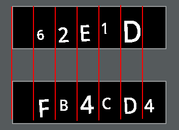

```python3
def slice_and_normalize(fn):  # fn: filepath to image file
    # writes `out2.png`

    img = Image.open(fn)
    img2 = Image.new('RGB', [420, 120], (0, 0, 0))

    # horizontally divide image in 6 parts
    trims = []
    x_offset = 42  # x-offset
    for _i in range(0, 6):
        area = (x_offset, 0, x_offset + 42, 81)
        cropped_img = img.crop(area)

        # trim each part
        trimmed = trim(cropped_img)
        if not trimmed:
            continue

        # resize character, retain aspect-ratio
        if trimmed.height >= 64 or trimmed.height <= 52:
            baseheight = 64
            hpercent = (baseheight / float(trimmed.size[1]))
            wsize = int((float(trimmed.size[0]) * float(hpercent)))
            trimmed = trimmed.resize((wsize, baseheight), Image.BICUBIC)
        trims.append(trimmed)
        x_offset += 42

    # find character with the greatest height
    baseline = max(z.height for z in trims)

    # construct new image, paste invidual characters
    x = 20
    for _i, char in enumerate(trims):
        voffset = (baseline - char.height) + 20  # vertically align
        x1 = x + char.width
        img2.paste(char, (x, voffset, x1, voffset + char.height))
        x += char.width + 20

    img2.thumbnail((150, 40))
    img2.save("out2.png")


def trim(img):
    # auto-crop image, remove empty space
    bg = Image.new(img.mode, img.size, img.getpixel((0, 0)))
    diff = ImageChops.difference(img, bg)
    diff = ImageChops.add(diff, diff, 2.0, -100)
    bbox = diff.getbbox()
    if bbox:
        return img.crop(bbox)
```

### Sample input


### Sample output

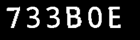

The method of resizing/aligning yield much better OCR results:

```text
$ gocr -C "0-9A-F" aero2020_cap5.png
73380E
```

But still not good enough. As you may have noticed `B` is interpreted as `8`.

# Google Vision API

Since we've exhausted our options with `gocr` we started looking at
online OCR tools and gave the [Google Vision API for OCR](https://cloud.google.com/vision/docs/ocr) a try.

The downside of using a Google Cloud service is that it requires a valid Google Cloud SDK account. In addition, at the moment of writing their SDK is still on Python version 2.


### `vision.py`

```python2
def detect_text(path):
    """Detects text in the file."""
    from google.cloud import vision
    import io
    client = vision.ImageAnnotatorClient()

    with io.open(path, 'rb') as image_file:
        content = image_file.read()

    image = vision.types.Image(content=content)
    response = client.text_detection(
        image=image,
        image_context={"language_hints": ["en"]})

    texts = response.text_annotations
    print(next(z.description for z in texts))


if __name__ == '__main__':
    import sys
    detect_text(sys.argv[1])

```

Install & run:

```bash
$ virtualenv -p /usr/bin/python2 venv2
$ source venv2/bin/activate
$ pip install google-cloud-storage
$ pip install google-cloud-vision

$ python2 vision.py aero2020_cap5.png
<OCR output>
```

Just like `gocr` - Google's result were not always 100% a match but in the case
of the image we previously tried to decode, it detected the `B` correctly.

### Incorperating

Our main script is in Python 3. So in order to call `vision.py` we must create a wrapper function that:

1. Sets the `GOOGLE_APPLICATION_CREDENTIALS` env. variable.
2. Executes `vision.py` through a Python2 virtualenv.

```python3
def vision(fn) -> str:  # fn: filepath to image
    return os.popen(
        "GOOGLE_APPLICATION_CREDENTIALS=/path/to/credentials.json "
        "/path/to/venv2/bin/python2 /path/to/vision.py "
        "text %s" % fn)\
        .read().strip().replace(" ", "")\
        .upper().replace(".", "0")\
        .replace("O", "0")
```

# Solution

We now know `gocr`'s weak points:

1. When `gocr` encounters a `B` it might OCR as `8`, and vice-versa.
2. When `gocr` does not regonize the character at all, it outputs an underscore `_`.
3. When `gocr`'s output has less than 4 characters, something is probably wrong.

If any of the above scenarios occur, we should switch to the Google Vision API.

So, our final solution should:

1. Fetch a captcha image.
2. Call `background_remove.pl` to filter out the background.
3. Align & resize the characters.
4. Use either `gocr` or Google Vision API for OCR, depending on OCR results.

### `solve.py`

`pip install pillow-simd requests numpy`

```python3
import os
import re

import PIL
import requests
from PIL import Image, ImageChops
import numpy as np


session = requests.session()
current_status = 0  # current captcha crack iteration
url = "http://tasks.aeroctf.com:40000"

def start():
    global session, url

    while True:
        # fetch new captcha
        resp = session.get(url + "/gen.php")

        # write original captcha
        fn = "data/c.png"
        f = open(fn, "wb")
        f.write(resp.content)
        f.close()

        # remove background, takes filepath, writes `out.png`
        os.popen("perl remove_background.pl \"%s\"" % fn).read()

        # normalize/align
        slice_and_normalize("out.png")

        # call gocr
        gocr_output = gocr("out2.png")

        # switch to Vision API if gocr messed up
        if "_" in gocr_output or "8" in gocr_output or len(gocr_output) < 4:
            vision_output = vision("out2.png")

            # submit Google's output
            captcha_submit(vision_output)
            continue

        # submit gocr output as-is
        captcha_submit(gocr_output)


def captcha_submit(word):
    global i, session, current_status

    resp = session.post(url + "/reg.php", data={"captha": word})
    content = resp.content.decode()

    status = re.findall(r"Captcha (\d+) of (\d+)", content)
    if not status:
        return

    if current_status > 0 and status[0][0] == "0":
        raise Exception("reset to captcha #0 detected " +
                        "invalid captcha entered, " +
                        "DEBUG ME!")

    if status[0][0] == "200":
        # WE MADE IT y00!!
        print(content)
        print(dict(session.headers))

    current_status = int(status[0][0])
    print(f"{status[0][0]}/{status[0][1]}")


start()
```

### Full captcha post processing example


`FB82`

## Captcha #200

After (finally) reaching our beloved captcha solve number 200, we are presented a HTML page with the message.

> You are surely not a bot, you may now register.

Using the `PHPSESSID` from our successful captcha crack run we
can register using a FORM submit:

```python3
import requests

cookies = {
    "PHPSESSID": "b4b68fdda20f598f57d528f9ef48b6e8"
}

data = {
    "name": "spotless",
    "pass": "spotless"
}

r = requests.post("http://tasks.aeroctf.com:40000/reg.php", data=data, cookies=cookies)
print(r)
```

And login to see a flag:

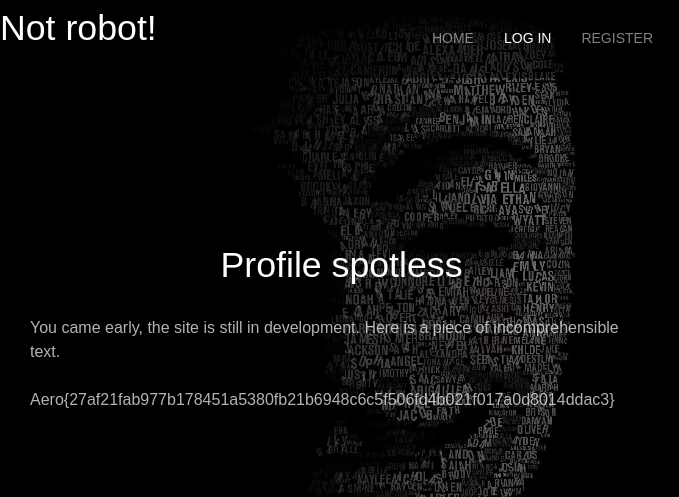

### Flag

`Aero{27af21fab977b178451a5380fb21b6948c6c5f506fd4b021f017a0d8014ddac3}`
