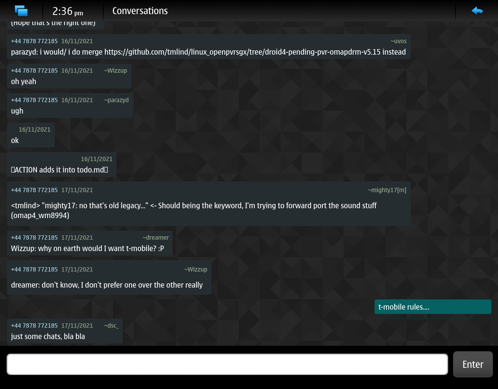
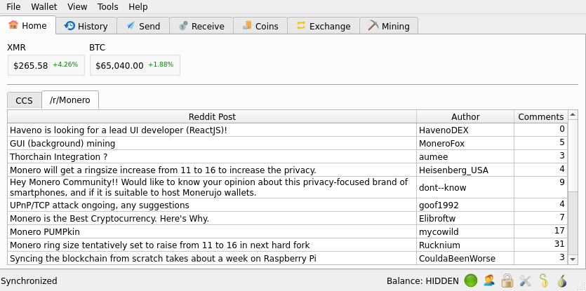
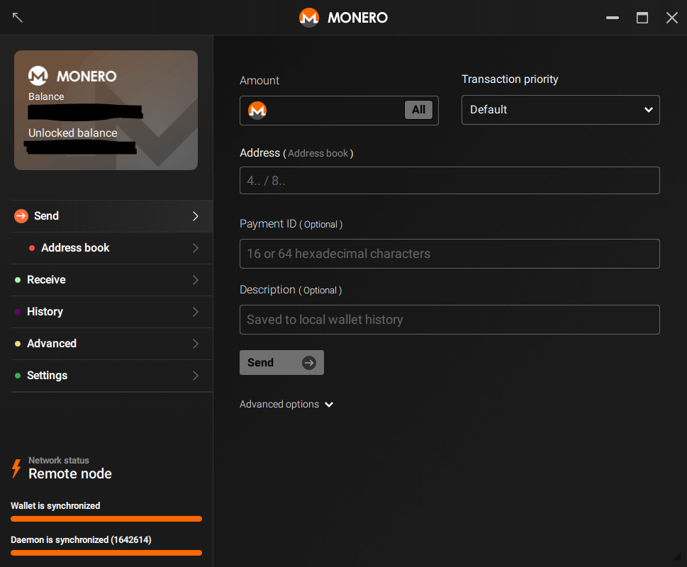
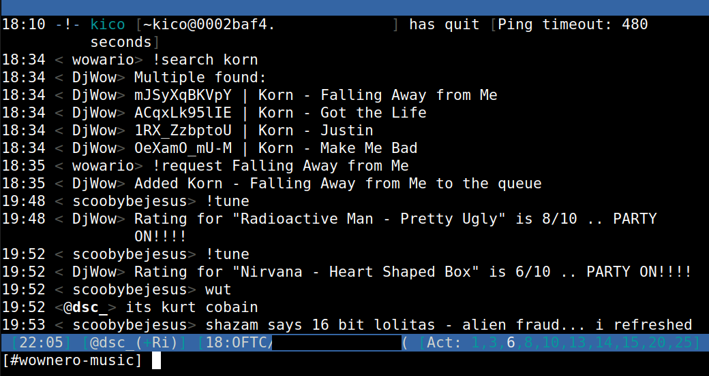
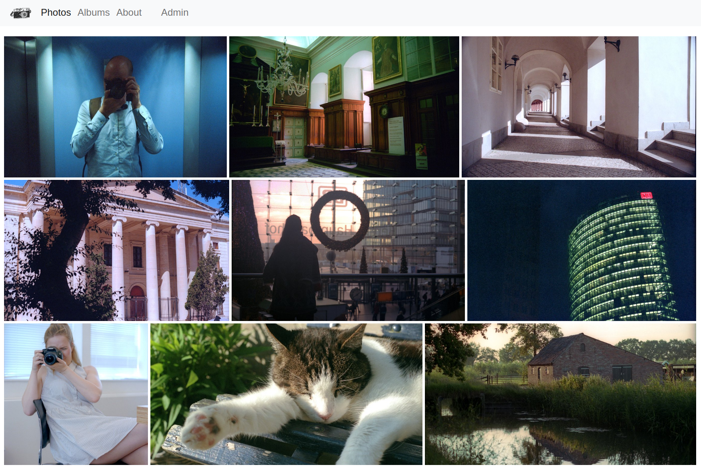

Title: Projects

Here is some stuff I have written over the years. I mainly use Python or C++.

## Libraries

Some Python libraries I've written.

- [quart-session](https://github.com/sanderfoobar/quart-session), (async) server-side session support for Quart applications
- [quart-session-openid](https://github.com/sanderfoobar/quart-session-openid), (async) OpenID Connect support for Quart applications
- [py-levin](https://github.com/sanderfoobar/py-levin), Python client for the Levin p2p protocol
- [flask-yoloapi](https://github.com/sanderfoobar/flask-yoloapi), small Flask library for creating simple JSON endpoints. 
  
## Large projects

Projects that took significant time to make.

### Conversations - Maemo Leste (2022)

Application that handles SMS messaging for Linux based phones running [Maemo Leste](https://maemo-leste.github.io/). Written in C++ with Qt. Uses [Telepathy](https://telepathy.freedesktop.org/) so you may hook up other messaging back-ends; like IRC or Telegram.

This application runs on hardware from 10+ years ago and is still performant.

[Source code on Github](https://github.com/maemo-leste/conversations)

 

### Feather wallet (2019-2020)

A desktop wallet for Monero written in C++ with Qt. Took a while to make from scratch!

- Ton of features
- Tor embedded
- 10k users (maybe?!)

I have since transferred project ownership to another person where it gets the proper development attention it needs.

[Feather wallet homepage](https://featherwallet.org)

 

### Monero GUI (2019)

I did a ton of contributions to the 'official' GUI desktop wallet for Monero, which is a QML application. 

- Worked with an UI designer to implement the interface in QML
- Added a bunch of features

[Source code](https://github.com/monero-project/monero-gui)

 

### IRC!Radio (2021)

An internet streaming service written in Python.

- IRC bot for adding and queuing songs from YouTube to the rotation
- Web application for searching the library
- Uses LiquidSoap and icecast2

[Source code](https://github.com/sanderfoobar/ircradio)

 

## Smaller projects

Projects that took limited time to make.

### Quart photo album (2021)

Photo hosting using this Python flickr clone, writen in a weekend.

- No javascript
- SQLite based backend
- Few dependencies

[Source code](https://github.com/sanderfoobar/quart-photo-site) | [Live example](https://photo.sanderf.nl)
